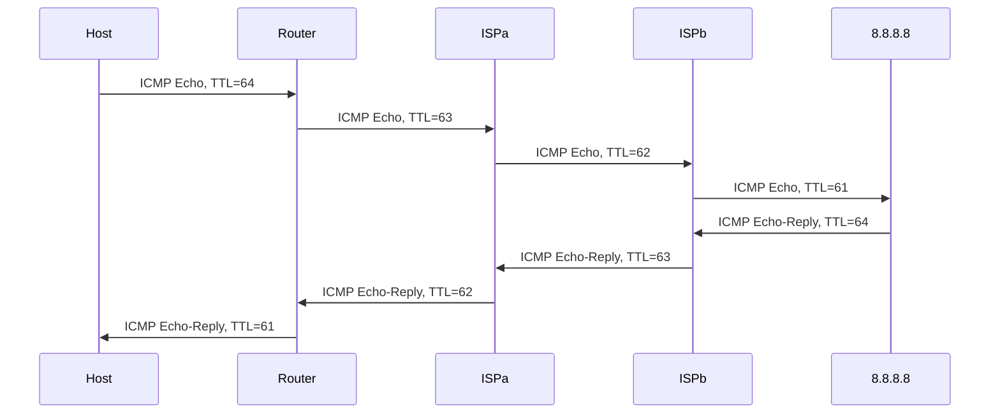

# Ping4 ICMPv4

```mermaid
sequenceDiagram
    Host->>Router: ICMP Echo, TTL=64
    Router->>ISPa: ICMP Echo, TTL=63
    ISPa->> ISPb: ICMP Echo, TTL=62
    ISPb->> 8.8.8.8: ICMP Echo, TTL=61
    8.8.8.8->> ISPb: ICMP Echo-Reply, TTL=64
    ISPb->>ISPa: ICMP Echo-Reply, TTL=63
    ISPa->>Router: ICMP Echo-Reply, TTL=62
    Router->>Host: ICMP Echo-Reply, TTL=61
```
