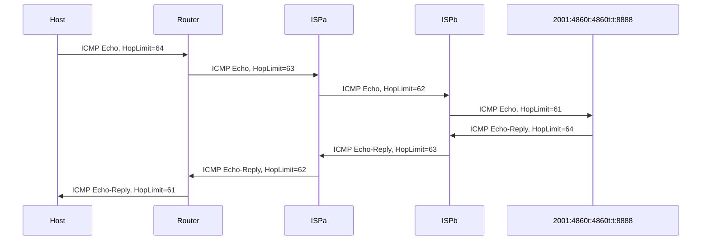

# Ping6 ICMPv6

```mermaid
sequenceDiagram
    participant Host
    participant Router
    participant ISPa
    participant ISPb
    participant endHost as  2001#58;4860t#58;4860t#58;t#58;8888
    Host->>Router: ICMP Echo, HopLimit=64
    Router->>ISPa: ICMP Echo, HopLimit=63
    ISPa->> ISPb: ICMP Echo, HopLimit=62
    ISPb->> endHost: ICMP Echo, HopLimit=61  
    endHost->> ISPb: ICMP Echo-Reply, HopLimit=64
    ISPb->>ISPa: ICMP Echo-Reply, HopLimit=63
    ISPa->>Router: ICMP Echo-Reply, HopLimit=62
    Router->>Host: ICMP Echo-Reply, HopLimit=61
```
